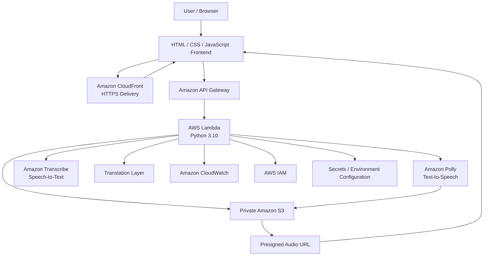

# Cloud-Based Multilingual TTS & STT System

> A serverless, cloud-based multilingual speech platform that converts text to natural speech, processes spoken audio into text, supports translation workflows, and securely delivers generated audio through AWS services.


---

## Table of Contents

- [Overview](#overview)
- [Key Features](#key-features)
- [System Architecture](#system-architecture)
- [Workflow](#workflow)
- [TTS Pipeline](#tts-pipeline)
- [STT Pipeline](#stt-pipeline)
- [Translation](#translation)
- [Tech Stack](#tech-stack)
- [AWS Services](#aws-services)
- [Security](#security)
- [Project Structure](#project-structure)
- [Getting Started](#getting-started)
- [Configuration](#configuration)
- [Deployment](#deployment)
- [Challenges & Solutions](#challenges--solutions)
- [Limitations](#limitations)
- [Future Improvements](#future-improvements)
- [Author](#author)

---

## Overview

This project is a **serverless multilingual Text-to-Speech (TTS) and Speech-to-Text (STT) system** built around AWS managed services.

The application provides a browser-based interface where users can submit text for speech generation or audio for speech recognition. The backend is exposed through **Amazon API Gateway** and processed by **Python AWS Lambda** functions.

For TTS, text is sent to **Amazon Polly**, the generated MP3 audio is stored in a private **Amazon S3** bucket, and the application returns a time-limited presigned URL for playback.

For STT, uploaded audio is processed through **Amazon Transcribe**. OpenAI Whisper was also explored as an alternative speech-recognition approach during development.

The architecture was designed to avoid managing traditional servers while keeping generated audio private and accessible only through controlled URLs.

---

## Key Features

- **Serverless architecture** — No continuously running application server.
- **Multilingual TTS** — Converts text into speech using Amazon Polly voices and supported languages.
- **Speech-to-Text** — Processes uploaded audio using Amazon Transcribe.
- **Whisper experimentation** — OpenAI Whisper was explored as an alternative STT engine.
- **Translation workflow** — Supports multilingual translation as part of the speech-processing pipeline.
- **Secure audio storage** — Generated audio is stored in a private S3 bucket.
- **Presigned URLs** — Audio is delivered through temporary, controlled-access URLs instead of public S3 objects.
- **REST/HTTP API layer** — API Gateway routes frontend requests to Lambda.
- **Browser frontend** — HTML/CSS/JavaScript interface for interacting with the speech services.
- **Cloud delivery** — CloudFront can be used to serve the frontend over HTTPS.
- **IAM-based access control** — AWS permissions are used to control service-to-service access.
- **Environment-based configuration** — Secrets and configuration values are kept outside source code.
- **Graceful cloud-service failure handling** — STT can return a controlled response when the required cloud service is unavailable because of billing/service limits.

---

## System Architecture



### Text Version

```text
Browser
   │
   ▼
CloudFront / HTTPS
   │
   ▼
API Gateway
   │
   ▼
AWS Lambda (Python)
   │
   ├──────────────► Amazon Polly ──► S3 ──► Presigned URL ──► Browser
   │
   ├──────────────► Amazon Transcribe ──► Text
   │
   └──────────────► Translation Layer
```

---

## Workflow

### 1. Text-to-Speech

1. The user enters text in the browser.
2. The frontend sends the request to API Gateway.
3. API Gateway invokes the Python Lambda function.
4. Lambda validates the request and sends the text to Amazon Polly.
5. Polly generates speech audio.
6. The generated MP3 is uploaded to the private S3 bucket.
7. Lambda generates a temporary presigned URL.
8. The URL is returned to the frontend.
9. The browser uses the URL to play the generated audio.

### 2. Speech-to-Text

1. The user selects or uploads an audio file.
2. The frontend sends the audio request through API Gateway.
3. Lambda processes the request and interacts with the speech-recognition service.
4. Amazon Transcribe processes the audio.
5. The resulting transcription is returned to the application.
6. The frontend displays the recognized text.

### 3. Translation

The application also includes a translation workflow so that multilingual speech-processing scenarios can be supported before or after TTS/STT processing.

---

## TTS Pipeline

```text
User Text
   │
   ▼
Frontend
   │
   ▼
API Gateway
   │
   ▼
Lambda
   │
   ▼
Amazon Polly
   │
   ▼
MP3 Audio
   │
   ▼
Private S3 Bucket
   │
   ▼
Presigned URL
   │
   ▼
Browser Audio Player
```

### Why S3 + Presigned URLs?

The generated audio is **not exposed as a public S3 object**.

Instead:

- S3 remains private.
- Lambda generates a temporary presigned URL.
- The browser can access the object only through that temporary URL.
- The URL expires automatically after its configured lifetime.

The deployed TTS flow used **one-hour presigned URLs** for generated audio.

---

## STT Pipeline

```text
Audio Input
   │
   ▼
Frontend
   │
   ▼
API Gateway
   │
   ▼
Lambda
   │
   ▼
Amazon Transcribe
   │
   ▼
Transcribed Text
   │
   ▼
Frontend
```

### Alternative STT Experimentation

**OpenAI Whisper** was also explored during development as an alternative speech-recognition engine.

This required additional dependency handling inside Lambda, including native Python dependencies and package-size considerations.

The deployed AWS-native STT path uses **Amazon Transcribe**.

When the cloud STT service is unavailable because of billing/service limits, the application is designed to fail gracefully instead of exposing a raw AWS error.

---

## Translation

Translation was incorporated to support multilingual speech workflows.

The project experimented with external translation approaches during development and also explored an OpenAI-based translation workflow.

The translation stage can conceptually be used as:

```text
Input Text / Transcription
          │
          ▼
     Translation
          │
          ▼
     Target Language
          │
          ▼
    Amazon Polly
          │
          ▼
       Speech
```

This allows a user to combine **speech recognition → translation → speech synthesis** for multilingual use cases.

---

## Tech Stack

| Layer | Technology |
|---|---|
| Frontend | HTML, CSS, JavaScript |
| Backend | Python |
| Compute | AWS Lambda |
| API | Amazon API Gateway |
| TTS | Amazon Polly |
| STT | Amazon Transcribe |
| STT Experimentation | OpenAI Whisper |
| Translation | Translation service / OpenAI-based workflow |
| Object Storage | Amazon S3 |
| CDN / HTTPS | Amazon CloudFront |
| Certificates | AWS Certificate Manager (ACM) |
| Monitoring | Amazon CloudWatch |
| Access Control | AWS IAM |
| Deployment Packaging | Lambda Layers / ZIP deployment |

---

## AWS Services

### AWS Lambda

Python Lambda functions provide the application logic without requiring a continuously running server.

Responsibilities include:

- Request handling
- Input validation
- Polly integration
- Transcribe integration
- S3 uploads
- Presigned URL generation
- Translation orchestration
- Error handling

### Amazon API Gateway

API Gateway provides the HTTP interface between the browser frontend and Lambda.

```text
Frontend
   │
   ▼
API Gateway
   │
   ▼
Lambda
```

### Amazon Polly

Polly performs text-to-speech conversion and returns generated speech audio.

### Amazon Transcribe

Transcribe provides cloud-based speech recognition for uploaded audio.

### Amazon S3

S3 stores generated audio files.

The bucket is intended to remain private, with temporary presigned URLs used for controlled access.

### Amazon CloudFront

CloudFront can serve the frontend and provide HTTPS-based delivery through the AWS edge network.

### AWS Certificate Manager

ACM is used for HTTPS certificate management when CloudFront is configured with a custom domain.

### Amazon CloudWatch

CloudWatch provides Lambda logs and helps troubleshoot runtime failures, API calls, dependency problems, and service integration issues.

### AWS IAM

IAM controls which AWS resources Lambda can access.

Typical permissions include access required for:

- Polly
- Transcribe
- S3
- CloudWatch logging

---

## Security

The project was designed with several security considerations:

### Private S3 Storage

Generated audio is stored in S3 without making the bucket publicly readable.

### Presigned URLs

Temporary URLs are used instead of exposing permanent public object URLs.

### IAM Least Privilege

Lambda should receive only the permissions required to perform its operations.

### Secret Management

API keys and sensitive configuration values should not be hard-coded into the repository.

### HTTPS

CloudFront + ACM can provide HTTPS delivery for the frontend.

### CORS

API Gateway/Lambda CORS configuration is required so that browser requests are accepted only from intended frontend origins.

### Input Validation

The backend should validate incoming text, audio metadata, and request structure before invoking cloud services.

---

## Project Structure

```text
tts-stt-cloud/
│
├── lambda/
│   ├── tts/
│   │   └── lambda_function.py
│   │
│   ├── stt/
│   │   └── lambda_function.py
│   │
│   └── translate/
│       └── lambda_function.py
│
├── frontend/
│   └── index.html
│
├── requirements.txt
├── .env.example
├── .gitignore
└── README.md
```

> The exact filenames may differ depending on the deployed repository structure. The structure above represents the logical separation of the TTS, STT, translation, and frontend components.

---

## Getting Started

### Prerequisites

- AWS account
- Python 3.10+
- AWS CLI
- Configured AWS credentials
- Amazon S3 bucket
- API Gateway
- Lambda
- Amazon Polly
- Amazon Transcribe
- CloudWatch
- IAM permissions
- Optional: CloudFront + ACM for HTTPS frontend delivery

### Clone the Repository

```bash
git clone <your-repository-url>
cd <your-repository-directory>
```

### Create a Virtual Environment

```bash
python -m venv venv
```

Activate it on Windows:

```bash
venv\Scripts\activate
```

Activate it on Linux/macOS:

```bash
source venv/bin/activate
```

### Install Dependencies

```bash
pip install -r requirements.txt
```

---

## Configuration

Create a local environment configuration based on the project's `.env.example`.

```env
AWS_REGION=your_aws_region
S3_BUCKET=your_private_bucket
```

If external APIs are used by the translation or Whisper components, keep their credentials outside the repository.

For example:

```env
OPENAI_API_KEY=your_api_key
```

> **Never commit API keys, AWS credentials, `.env` files, or other secrets to GitHub.**

---

## Deployment

The core deployment flow is:

```text
Frontend
   │
   ▼
CloudFront / Static Hosting
   │
   ▼
API Gateway
   │
   ▼
AWS Lambda
   │
   ├── Polly
   ├── Transcribe
   ├── S3
   └── Translation / External APIs
```

### Lambda

The application logic is packaged and deployed as Python Lambda functions.

Where dependencies are too large for a direct function ZIP, **Lambda Layers** can be used to separate reusable dependencies from the application code.

### API Gateway

Configure API routes to invoke the appropriate Lambda functions for TTS, STT, and translation operations.

### S3

Create a private bucket for generated audio and configure the required Lambda permissions.

### CloudFront + ACM

For production-style frontend delivery:

1. Host the frontend.
2. Configure CloudFront.
3. Associate an ACM certificate.
4. Configure the required domain and HTTPS settings.
5. Configure CORS on the API.

---

## Challenges & Solutions

### 1. Lambda Dependency Size

Some speech and AI libraries introduced large dependency trees and native binaries.

**Approach:**  
Dependencies were reduced where possible and Lambda Layers were explored to separate large libraries from the main function package.

---

### 2. Whisper Dependencies

OpenAI Whisper introduced additional dependencies that were more difficult to package for Lambda, including native components such as `pydantic_core`.

**Approach:**  
Dependency packaging and Lambda-compatible builds were investigated, while Amazon Transcribe provided an AWS-native alternative for the deployed STT path.

---

### 3. S3 Access

Directly exposing generated audio through public S3 URLs would weaken the storage security model.

**Approach:**  
The bucket remains private and Lambda generates temporary presigned URLs.

---

### 4. Presigned URL Expiration

Generated audio URLs are temporary and therefore expire.

**Approach:**  
The application returns a fresh presigned URL whenever new audio is generated.

---

### 5. CORS

Browser requests from the frontend can be rejected when API Gateway/Lambda CORS configuration does not match the frontend origin.

**Approach:**  
CORS headers and API Gateway configuration were adjusted so that browser-based requests could reach the backend correctly.

---

### 6. API Gateway Integration

Incorrect routes, methods, or Lambda integrations can result in failed requests even when the Lambda function itself works.

**Approach:**  
API Gateway routes were configured to forward the appropriate requests to the Lambda backend.

---

### 7. Secrets and API Keys

External APIs require credentials, but exposing those credentials in frontend code or GitHub would create a security risk.

**Approach:**  
Sensitive values were kept in backend configuration rather than embedded in client-side code.

---

### 8. AWS Billing / Service Limits

Some AWS services require billing to be enabled beyond free-tier availability.

When the deployed Transcribe path became unavailable because of cloud-service billing limits, the application was designed to handle the failure gracefully rather than exposing an unhandled AWS exception.

Expected fallback response:

```text
Speech-to-Text unavailable due to cloud service billing limits.
```

---

## Limitations

- AWS service availability depends on account configuration, region, quotas, and billing status.
- Amazon Transcribe may require asynchronous job handling for certain audio-processing workflows.
- Lambda has execution-time, memory, storage, and package-size limits.
- Large AI/Whisper dependencies can be difficult to package within Lambda constraints.
- Presigned URLs are temporary and expire by design.
- Translation quality depends on the selected translation model/service.
- Cloud costs can increase with high-volume speech processing.
- CORS and API configuration must be correctly aligned with the deployed frontend.

---

## Future Improvements

- Add authentication and per-user access control.
- Introduce Amazon Cognito for user management.
- Add asynchronous processing through SQS/EventBridge.
- Store transcription history and metadata in a persistent database.
- Add richer multilingual voice selection.
- Improve audio-format validation and conversion.
- Add usage monitoring and cost controls.
- Add infrastructure-as-code using Terraform or AWS CDK.
- Containerize heavier Whisper-based workloads where Lambda packaging becomes impractical.
- Add automated CI/CD deployment through GitHub Actions.
- Add automated tests for TTS, STT, translation, and API integration.

---

## Architecture Summary

The project demonstrates how a complete speech-processing application can be built using managed cloud services rather than a traditional always-on backend.

```text
                 ┌─────────────────────┐
                 │      Browser        │
                 │   HTML/CSS/JS       │
                 └──────────┬──────────┘
                            │
                            ▼
                 ┌─────────────────────┐
                 │   CloudFront /      │
                 │       HTTPS         │
                 └──────────┬──────────┘
                            │
                            ▼
                 ┌─────────────────────┐
                 │   API Gateway       │
                 └──────────┬──────────┘
                            │
                            ▼
                 ┌─────────────────────┐
                 │   AWS Lambda        │
                 │     Python          │
                 └─────┬─────┬─────┬───┘
                       │     │     │
             ┌─────────┘     │     └──────────┐
             ▼               ▼                ▼
        ┌─────────┐    ┌───────────┐    ┌────────────┐
        │  Polly  │    │ Transcribe│    │ Translation│
        └────┬────┘    └─────┬─────┘    └────────────┘
             │               │
             ▼               ▼
        ┌─────────┐      Transcription
        │   S3    │
        └────┬────┘
             │
             ▼
      Presigned URL
             │
             ▼
          Browser
```

---

## Author

**Koushik Sai Talluri**

Integrated M.Tech CSE — VIT-AP University

GitHub: [@KOUSHIK-SAI-TALLURI](https://github.com/KOUSHIK-SAI-TALLURI)

---

> This project is a cloud-based prototype demonstrating serverless architecture, multilingual speech processing, AWS service integration, secure object delivery, and practical handling of cloud deployment constraints.
